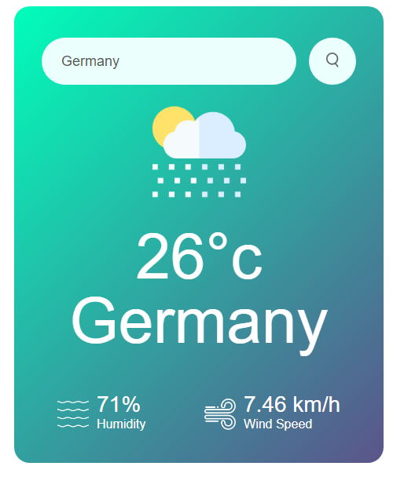

# Weather App 🌦️

Welcome to our Weather App! This project was created as a collaborative effort between [Ruchin Audichya](https://github.com/Ruchin-Audichya) and [Shriya Gakkhar](https://github.com/shriya-gakkhar1), inspired by the Greatstack video tutorial. Our app provides real-time weather updates using HTML, CSS, and JavaScript.


## Features
- 🌍 **Location-Based Weather**: Get weather updates based on your current location.
- 🌤️ **Real-Time Data**: Fetches real-time weather data using a weather API.
- 🎨 **Responsive Design**: Optimized for both desktop and mobile devices.
- 🌈 **User-Friendly Interface**: Clean and intuitive UI for a seamless user experience.

## Technologies Used
- **HTML5**: For the structure and content of the app.
- **CSS3**: For styling and layout.
- **JavaScript**: For fetching data and dynamic content updates.

## Screenshots


## Setup & Installation
1. Clone the repository:
   ```bash
   git clone https://github.com/Ruchin-Audichya/Weather-App-0.1-
   ```
2. Navigate to the project directory:
   ```bash
   cd weather-app
   ```
3. Open `index.html` in your browser to see the app in action.

## Usage
1. Allow location access when prompted by the browser.
2. View the current weather details for your location.

## Credits
This project was inspired by [Greatstack's]([https://www.youtube.com/c/Greatstack]) video tutorial on creating a weather app. 

Special thanks to:
- [PeepKIN](https://github.com/Ruchin-Audichya)
- [Jojo.brown](https://github.com/shriya-gakkhar1/)

## Contact
For any inquiries or feedback, please reach out:
Github
---

<p align="center">
    
</p>

<p align="center">
    Made with ❤️ by [PeepKIN] and [Jojo.Brown]
</p>

